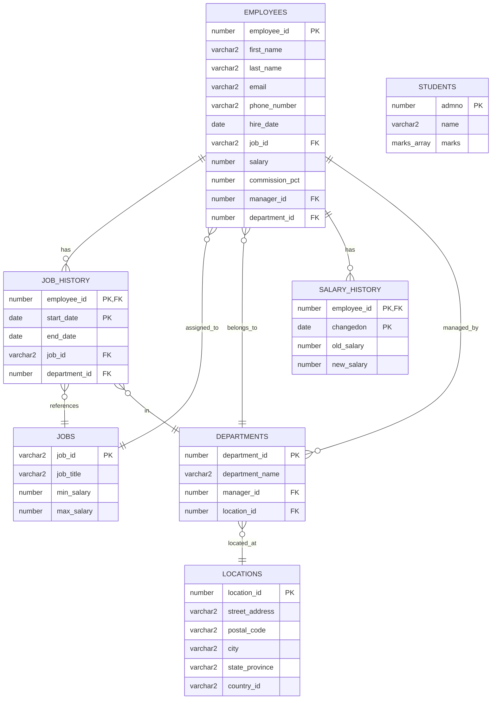
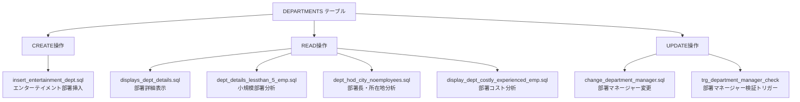
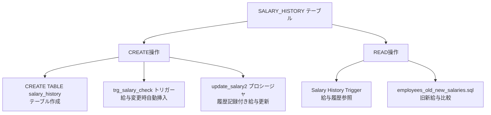
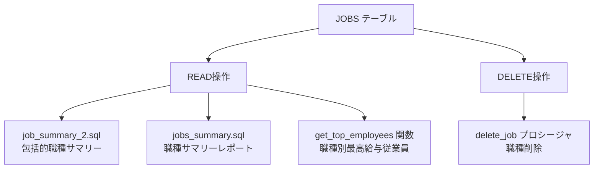
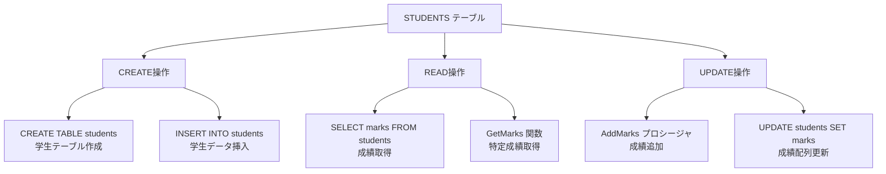
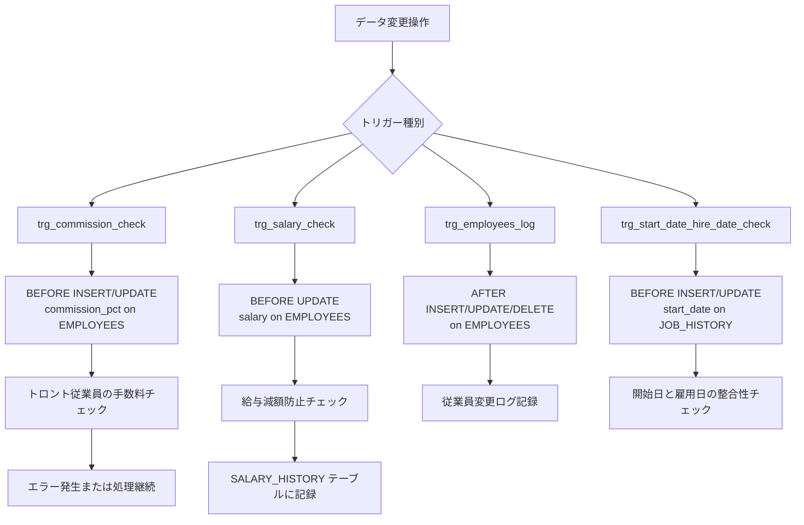
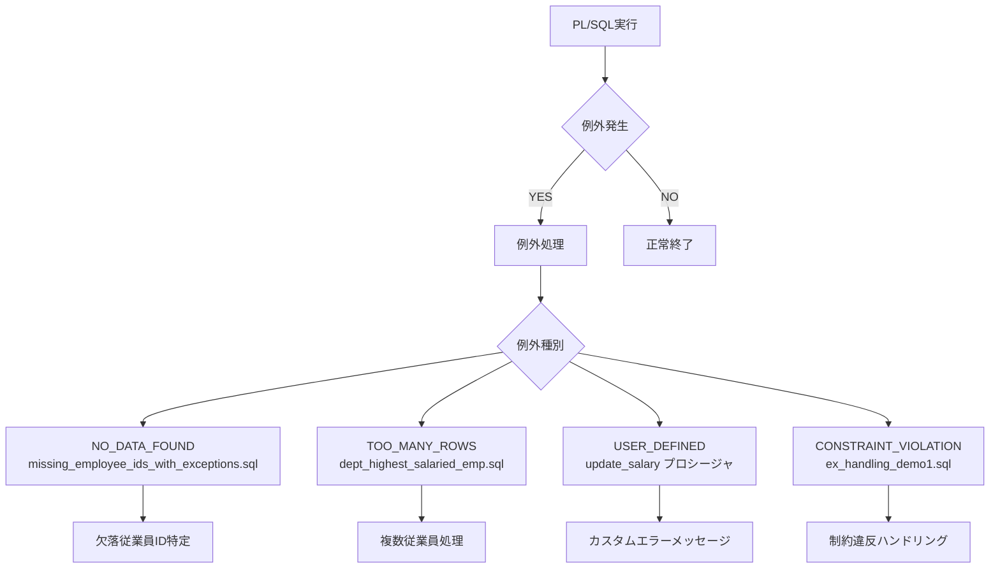
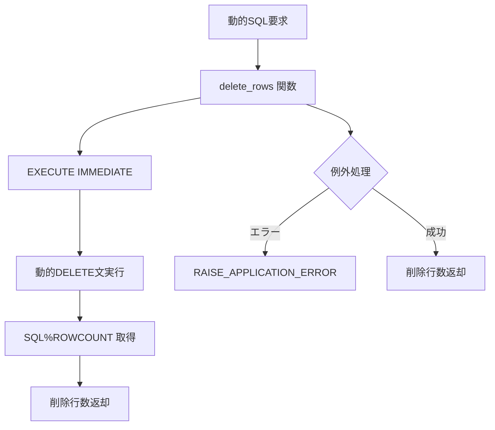

# PL/SQL サンプルリポジトリ - CRUD操作図

## 概要
このドキュメントは、DevinTest PL/SQLサンプルリポジトリ内のすべてのCRUD（Create, Read, Update, Delete）操作を視覚的に表現したものです。

## データベースエンティティ関係図

## EMPLOYEES テーブル CRUD操作

```mermaid
graph TD
    A[EMPLOYEES テーブル] --> B[CREATE操作]
    A --> C[READ操作]
    A --> D[UPDATE操作]
    A --> E[DELETE操作]
    
    B --> B1[insert_entertainment_dept.sql<br/>新部署作成時の従業員参照]
    
    C --> C1[get_employees_by_dept.sql<br/>部署別従業員取得]
    C --> C2[get_highest_paid_employees.sql<br/>最高給与従業員取得]
    C --> C3[employees_by_year.sql<br/>年別従業員表示]
    C --> C4[dept_highest_salaried_emp.sql<br/>部署最高給与従業員]
    C --> C5[employee_info.sql<br/>従業員情報取得]
    C --> C6[salary_stats.sql<br/>給与統計分析]
    C --> C7[BONUS_CALCULATION.SQL<br/>ボーナス計算]
    C --> C8[display_dept_costly_experienced_emp.sql<br/>高コスト経験従業員]
    
    D --> D1[update_salary プロシージャ<br/>基本給与更新]
    D --> D2[update_salary2 プロシージャ<br/>拡張給与更新]
    D --> D3[hike_salary_for_150.sql<br/>特定従業員給与増加]
    D --> D4[interchange_salary.sql<br/>給与交換操作]
    D --> D5[change_department_manager.sql<br/>部署マネージャー変更]
    D --> D6[Procedure Change_Manager<br/>マネージャー変更]
    
    E --> E1[delete_rows 関数<br/>動的行削除]
```

## DEPARTMENTS テーブル CRUD操作

## SALARY_HISTORY テーブル CRUD操作

## JOBS テーブル CRUD操作

## STUDENTS テーブル CRUD操作（VARRAY デモ）

## トリガー操作フロー

## 例外処理パターン

## 動的SQL操作

## ファイル別CRUD操作マッピング

| ファイル名 | CREATE | READ | UPDATE | DELETE |
|------------|--------|------|--------|--------|
| `get_employees_by_dept.sql` | - | ✓ | - | - |
| `update_salary` | - | ✓ | ✓ | - |
| `BONUS_CALCULATION.SQL` | - | ✓ | - | - |
| `trg_salary_check` | ✓ | - | - | - |
| `delete_rows` | - | - | - | ✓ |
| `VARRAY Demo` | ✓ | ✓ | ✓ | - |
| `insert_entertainment_dept.sql` | ✓ | ✓ | - | - |
| `salary_stats.sql` | - | ✓ | - | - |
| `employees_by_year.sql` | - | ✓ | - | - |
| `dept_highest_salaried_emp.sql` | - | ✓ | - | - |
| `missing_employee_ids_with_exceptions.sql` | - | ✓ | - | - |
| `ex_handling_demo1.sql` | - | - | ✓ | - |
| `get_highest_paid_employees.sql` | - | ✓ | - | - |
| `interchange_salary.sql` | - | ✓ | ✓ | - |
| `change_department_manager.sql` | - | ✓ | ✓ | - |

---
*生成日: 2025年8月12日*  
*リポジトリ: hh4aws-creator/DevinTest*  
*68以上のPL/SQLファイルのCRUD操作を包括的に分析*
