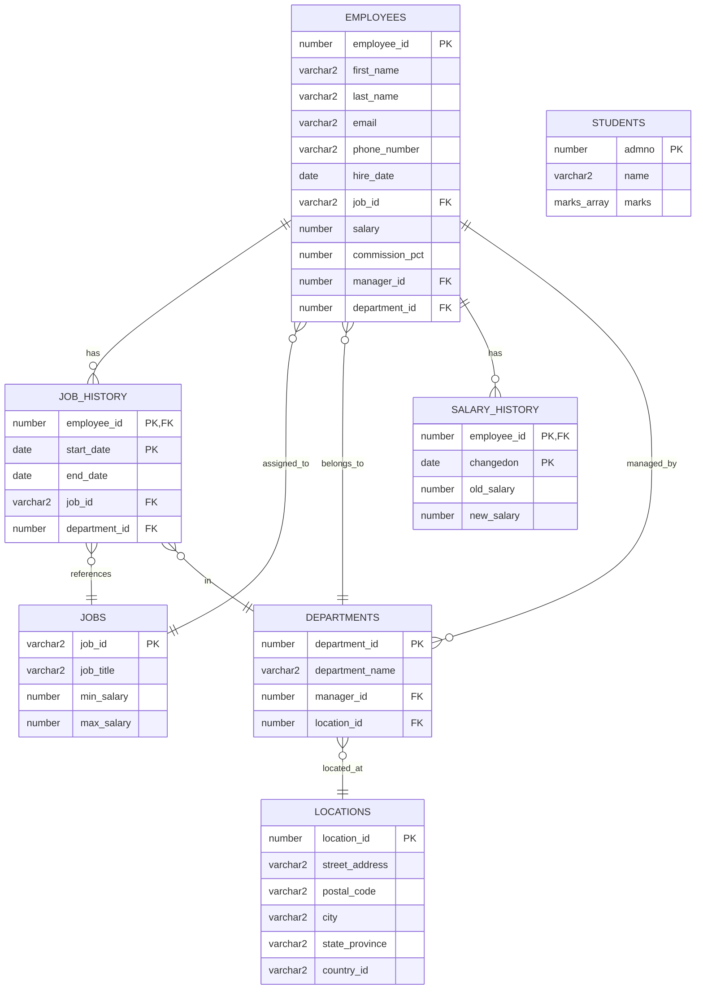
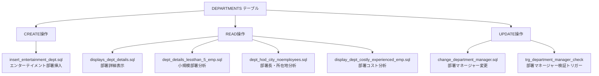
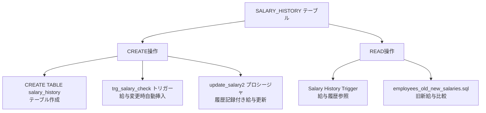
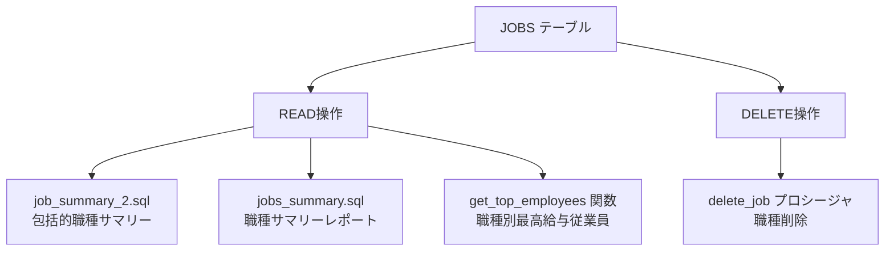
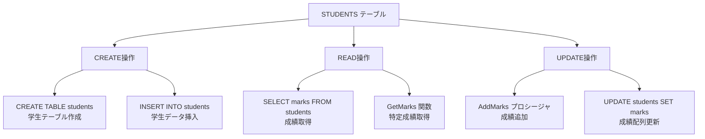
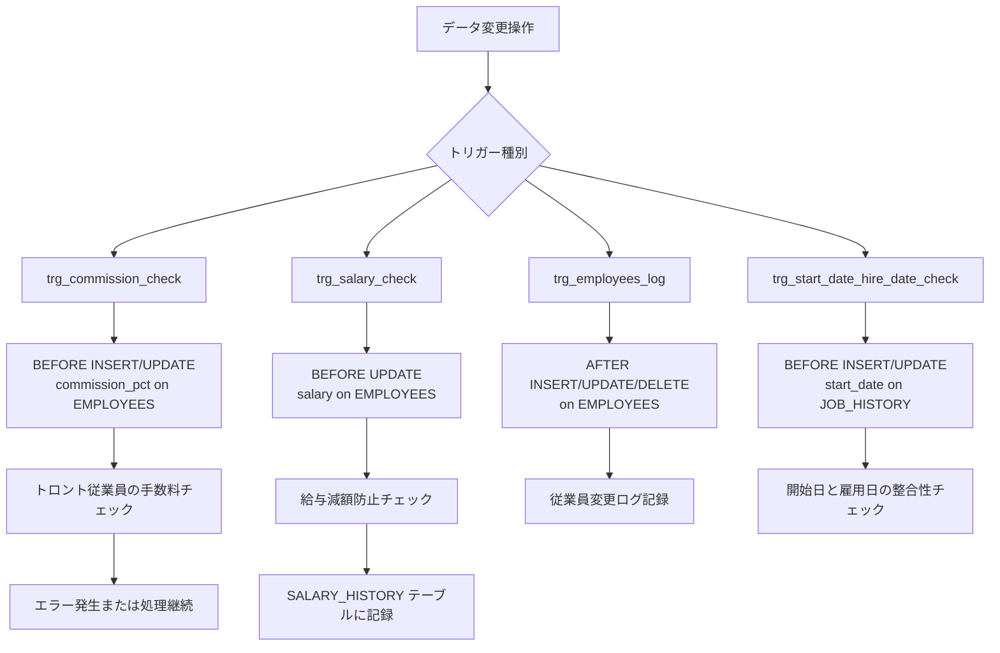
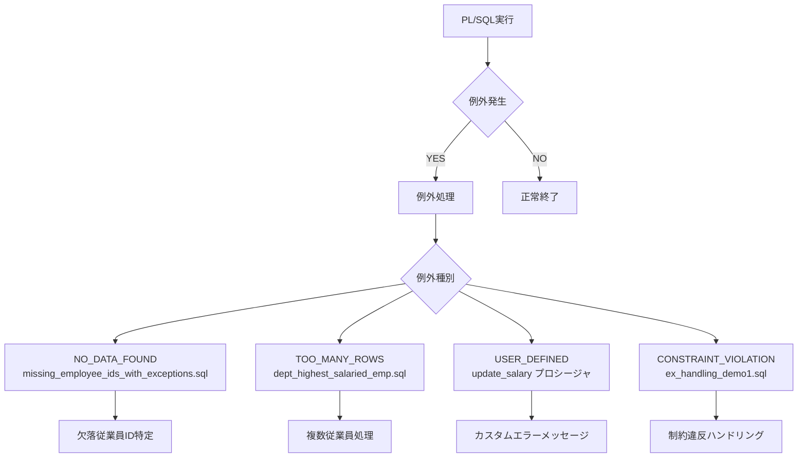
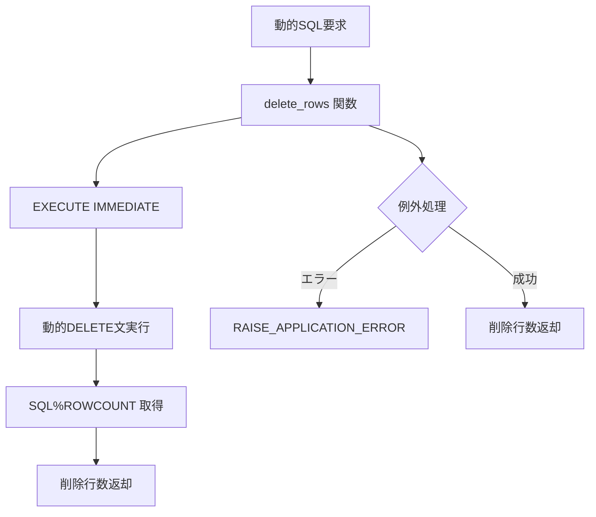

# PL/SQL サンプルリポジトリ - CRUD操作詳細図

## 概要
このドキュメントは、DevinTest PL/SQLサンプルリポジトリ内の全68以上のファイルについて、各ファイルがどのテーブルに対してどのCRUD操作（Create, Read, Update, Delete）を実行するかを詳細に示したものです。物理名（ファイル名、テーブル名）は英語で記載し、説明は日本語話者に分かりやすく作成しています。

## データベースエンティティ関係図

## EMPLOYEES テーブル CRUD操作

```mermaid
graph TD
    A[EMPLOYEES テーブル] --> B[CREATE操作]
    A --> C[READ操作]
    A --> D[UPDATE操作]
    A --> E[DELETE操作]
    
    B --> B1[insert_entertainment_dept.sql<br/>新部署作成時の従業員参照]
    
    C --> C1[get_employees_by_dept.sql<br/>部署別従業員取得]
    C --> C2[get_highest_paid_employees.sql<br/>最高給与従業員取得]
    C --> C3[employees_by_year.sql<br/>年別従業員表示]
    C --> C4[dept_highest_salaried_emp.sql<br/>部署最高給与従業員]
    C --> C5[employee_info.sql<br/>従業員情報取得]
    C --> C6[salary_stats.sql<br/>給与統計分析]
    C --> C7[BONUS_CALCULATION.SQL<br/>ボーナス計算]
    C --> C8[display_dept_costly_experienced_emp.sql<br/>高コスト経験従業員]
    
    D --> D1[update_salary プロシージャ<br/>基本給与更新]
    D --> D2[update_salary2 プロシージャ<br/>拡張給与更新]
    D --> D3[hike_salary_for_150.sql<br/>特定従業員給与増加]
    D --> D4[interchange_salary.sql<br/>給与交換操作]
    D --> D5[change_department_manager.sql<br/>部署マネージャー変更]
    D --> D6[Procedure Change_Manager<br/>マネージャー変更]
    
    E --> E1[delete_rows 関数<br/>動的行削除]
```

## DEPARTMENTS テーブル CRUD操作

## SALARY_HISTORY テーブル CRUD操作

## JOBS テーブル CRUD操作

## STUDENTS テーブル CRUD操作（VARRAY デモ）

## トリガー操作フロー

## 例外処理パターン

## 動的SQL操作

## ファイル別・テーブル別 CRUD操作詳細マッピング

### EMPLOYEES テーブル操作

| ファイル名 | C | R | U | D | 操作内容（日本語） |
|------------|---|---|---|---|-------------------|
| `get_employees_by_dept.sql` | - | ✓ | - | - | 部署別従業員情報の取得 |
| `Update_Salary Procedure` | - | ✓ | ✓ | - | 従業員給与の読み取りと更新 |
| `BONUS_CALCULATION.SQL` | - | ✓ | - | - | ボーナス計算のための従業員データ読み取り |
| `Salary History Trigger` | - | ✓ | ✓ | - | 給与変更時の従業員データ参照と更新 |
| `get_highest_paid_employees.sql` | - | ✓ | - | - | 最高給与従業員の検索 |
| `employees_by_year.sql` | - | ✓ | - | - | 年別従業員データの表示 |
| `dept_highest_salaried_emp.sql` | - | ✓ | - | - | 部署内最高給与従業員の特定 |
| `employee_info.sql` | - | ✓ | - | - | 従業員基本情報の取得 |
| `salary_stats.sql` | - | ✓ | - | - | 給与統計分析のためのデータ読み取り |
| `interchange_salary.sql` | - | ✓ | ✓ | - | 従業員間の給与交換操作 |
| `change_department_manager.sql` | - | ✓ | ✓ | - | 部署マネージャーの変更 |
| `hike_salary_for_150.sql` | - | ✓ | ✓ | - | 特定従業員（ID:150）の給与増額 |
| `employees_old_new_salaries.sql` | - | ✓ | - | - | 従業員の旧給与と新給与の比較 |
| `employees_salary_gap` | - | ✓ | - | - | 従業員間の給与格差分析 |
| `employees_salary_log` | - | ✓ | - | - | 従業員給与ログの参照 |
| `employees_percentage_by_month` | - | ✓ | - | - | 月別従業員割合の計算 |
| `show_employee_grade.sql` | - | ✓ | - | - | 従業員等級の表示 |
| `trg_employees_log` | ✓ | - | - | - | 従業員変更ログの作成 |
| `trg_commission_check` | - | ✓ | - | - | 手数料チェック時の従業員データ参照 |
| `trg_salary_change_log` | ✓ | - | - | - | 給与変更ログの作成 |
| `ex_handling_demo1.sql` | - | ✓ | ✓ | - | 例外処理デモでの従業員データ操作 |
| `missing_employee_ids_with_exceptions.sql` | - | ✓ | - | - | 欠落従業員IDの特定 |
| `missing_employeeids.sql` | - | ✓ | - | - | 欠落従業員IDの検索 |

### DEPARTMENTS テーブル操作

| ファイル名 | C | R | U | D | 操作内容（日本語） |
|------------|---|---|---|---|-------------------|
| `insert_entertainment_dept.sql` | ✓ | ✓ | - | - | エンターテイメント部署の新規作成と参照 |
| `displays_dept_details.sql` | - | ✓ | - | - | 部署詳細情報の表示 |
| `dept_details_lessthan_5_emp.sql` | - | ✓ | - | - | 5人未満の小規模部署の分析 |
| `dept_hod_city_noemployees.sql` | - | ✓ | - | - | 部署長・所在地・従業員数の分析 |
| `display_dept_costly_experienced_emp.sql` | - | ✓ | - | - | 部署別高コスト経験従業員の表示 |
| `change_department_manager.sql` | - | ✓ | ✓ | - | 部署マネージャーの変更 |
| `trg_department_manager_check` | - | ✓ | - | - | 部署マネージャー検証トリガー |
| `Details of Departments` | - | ✓ | - | - | 部署詳細の表示 |
| `Display Department Details` | - | ✓ | - | - | 部署詳細の表示 |
| `Display Department name and HOD` | - | ✓ | - | - | 部署名と部署長の表示 |
| `Display department name and HOD using cursor` | - | ✓ | - | - | カーソルを使用した部署名と部署長の表示 |
| `Display employees by department` | - | ✓ | - | - | 部署別従業員の表示 |
| `Display Employees By Dept` | - | ✓ | - | - | 部署別従業員の表示 |

### JOBS テーブル操作

| ファイル名 | C | R | U | D | 操作内容（日本語） |
|------------|---|---|---|---|-------------------|
| `job_summary_2.sql` | - | ✓ | - | - | 包括的職種サマリーの生成 |
| `jobs_summary.sql` | - | ✓ | - | - | 職種サマリーレポートの作成 |
| `get_employees_by_job function` | - | ✓ | - | - | 職種別従業員の取得 |
| `get_job_history function` | - | ✓ | - | - | 職歴情報の取得 |
| `manager_job_history function` | - | ✓ | - | - | マネージャー職歴の取得 |
| `delete_job procedure` | - | - | - | ✓ | 職種の削除 |
| `current_job_start_date.sql` | - | ✓ | - | - | 現在の職種開始日の取得 |
| `current_job_start_date_for_all_employees.sql` | - | ✓ | - | - | 全従業員の現在職種開始日取得 |

### JOB_HISTORY テーブル操作

| ファイル名 | C | R | U | D | 操作内容（日本語） |
|------------|---|---|---|---|-------------------|
| `get_job_history function` | - | ✓ | - | - | 職歴データの取得 |
| `manager_job_history function` | - | ✓ | - | - | マネージャー職歴の参照 |
| `Display Employees and History Count By Job` | - | ✓ | - | - | 職種別従業員と職歴数の表示 |
| `trg_start_date_hire_date_check` | - | ✓ | - | - | 開始日と雇用日の整合性チェック |
| `current_job_start_date.sql` | - | ✓ | - | - | 現在職種の開始日取得 |
| `current_job_start_date_for_all_employees.sql` | - | ✓ | - | - | 全従業員の現在職種開始日 |

### SALARY_HISTORY テーブル操作

| ファイル名 | C | R | U | D | 操作内容（日本語） |
|------------|---|---|---|---|-------------------|
| `Salary History Trigger` | ✓ | ✓ | - | - | 給与履歴テーブルの作成と参照 |
| `trg_salary_check` | ✓ | - | - | - | 給与変更時の履歴レコード自動作成 |
| `employees_old_new_salaries.sql` | - | ✓ | - | - | 旧給与と新給与の比較データ取得 |

### LOCATIONS テーブル操作

| ファイル名 | C | R | U | D | 操作内容（日本語） |
|------------|---|---|---|---|-------------------|
| `dept_hod_city_noemployees.sql` | - | ✓ | - | - | 所在地情報の参照 |
| `displays_dept_details.sql` | - | ✓ | - | - | 部署所在地詳細の表示 |

### STUDENTS テーブル操作（VARRAY デモ）

| ファイル名 | C | R | U | D | 操作内容（日本語） |
|------------|---|---|---|---|-------------------|
| `VARRAY Demo` | ✓ | ✓ | ✓ | - | 学生テーブル作成、データ挿入、成績参照・更新 |

### 動的SQL操作

| ファイル名 | C | R | U | D | 操作内容（日本語） |
|------------|---|---|---|---|-------------------|
| `delete_rows` | - | - | - | ✓ | 動的SQLによる任意テーブルからの行削除 |

### 集計・分析専用操作

| ファイル名 | C | R | U | D | 操作内容（日本語） |
|------------|---|---|---|---|-------------------|
| `Calculate Salary` | - | ✓ | - | - | 給与計算処理 |
| `Find out salary hike` | - | ✓ | - | - | 給与増額の算出 |
| `Employees Count By Salary Range` | - | ✓ | - | - | 給与範囲別従業員数の集計 |
| `Monthly emp count for year with max employees` | - | ✓ | - | - | 最大従業員数年の月別従業員数 |
| `count_employees_by_month.sql` | - | ✓ | - | - | 月別従業員数の集計 |
| `month__employees__recent_year.sql` | - | ✓ | - | - | 最近年の月別従業員数 |

### プロシージャ・関数操作

| ファイル名 | C | R | U | D | 操作内容（日本語） |
|------------|---|---|---|---|-------------------|
| `Procedure Change_Manager` | - | ✓ | ✓ | - | マネージャー変更プロシージャ |
| `change_salary procedure` | - | ✓ | ✓ | - | 給与変更プロシージャ |
| `Populate DEPT_EMP table` | ✓ | ✓ | - | - | 部署従業員テーブルの作成と投入 |
| `Update salary based on conditions` | - | ✓ | ✓ | - | 条件に基づく給与更新 |
| `Employee Information` | - | ✓ | - | - | 従業員情報の取得 |
| `Explicit cursor example` | - | ✓ | - | - | 明示的カーソルの使用例 |
| `using implicit cursor` | - | ✓ | - | - | 暗黙的カーソルの使用例 |
| `hike_salary_by_dept` | - | ✓ | ✓ | - | 部署別給与増額処理 |

---
*生成日: 2025年8月12日*  
*リポジトリ: hh4aws-creator/DevinTest*  
*68以上のPL/SQLファイルのCRUD操作を包括的に分析*
